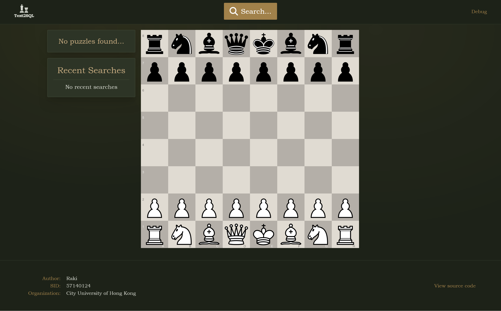
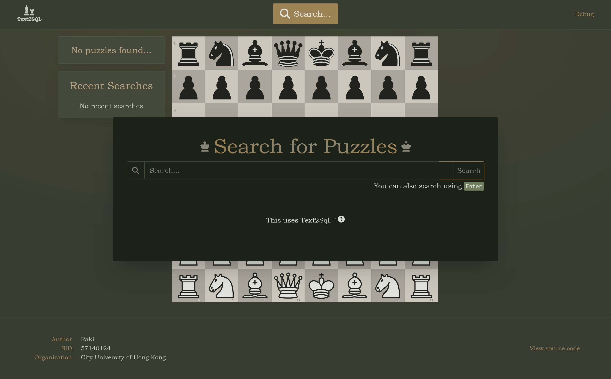
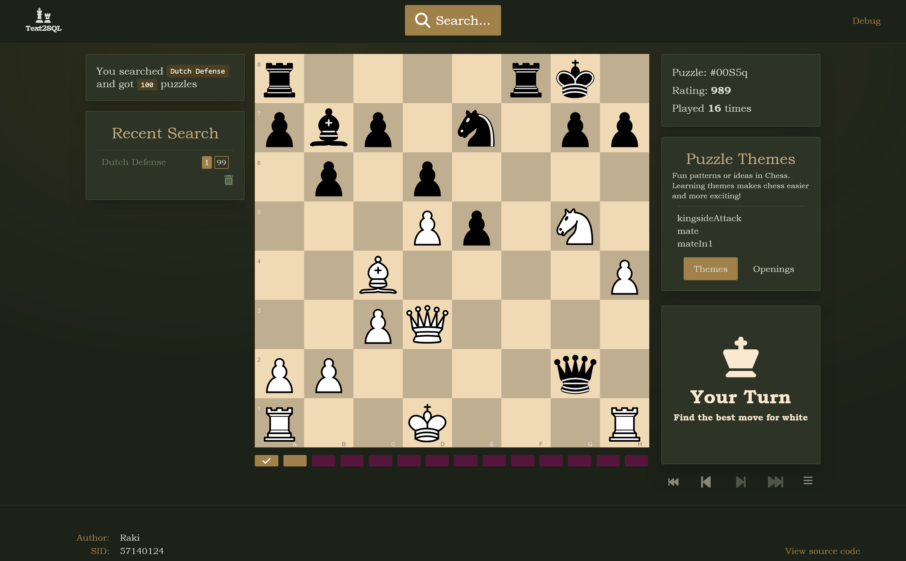
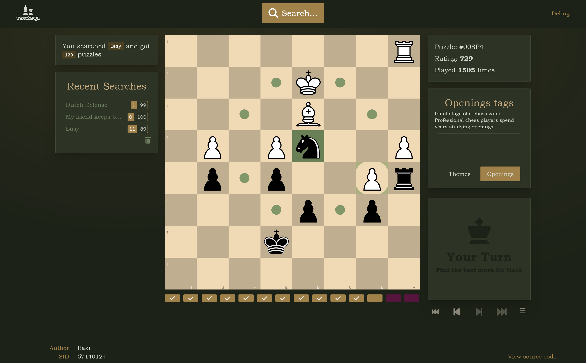
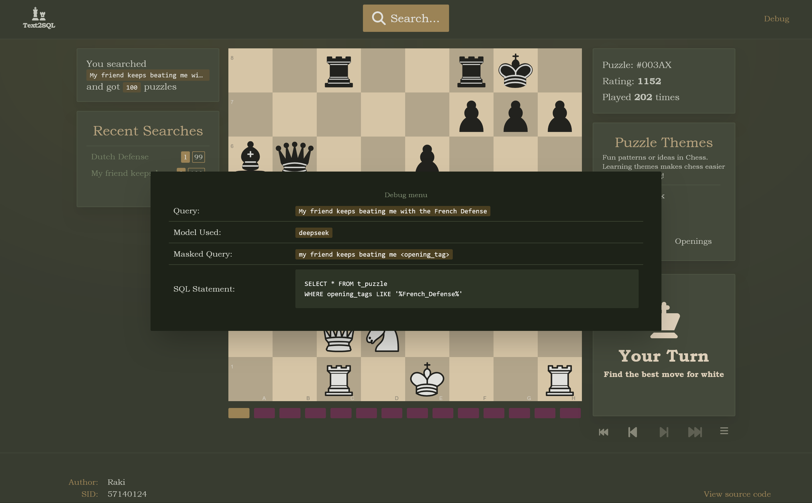
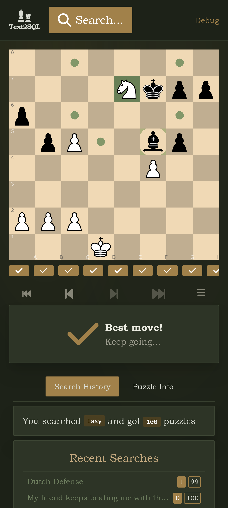
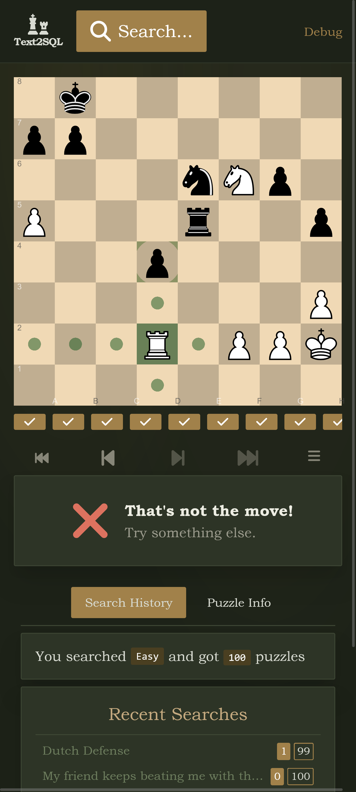

```
 \+/    \^/   (V)   ("\   [-]    _   ┏┓┓             ┓    ┏┳┓     ┏┓┏┓┏┓┓     _     [-]   ("\   (V)   \^/   \+/
 ) (    ) (   ) (   ) '   | |   ( )  ┃ ┣┓┏┓┏┏  ┏┓┓┏┓┓┃┏┓   ┃ ┏┓┓┏╋┏┛┗┓┃┃┃    ( )    | |   ) '   ) (   ) (   ) (
/___\  /___\ /___\ /___\ /___\ /___\ ┗┛┛┗┗ ┛┛  ┣┛┗┻┗┗┗┗    ┻ ┗ ┛┗┗┗━┗┛┗┻┗┛  /___\  /___\ /___\ /___\ /___\ /___\
                                               ┛                                       
```
<p align="center">
 City University of Hong Kong
</br>
 CS4514
</br>
 24CS110
 </br>
 <a href="https://github.com/M0bilizer/Chess-Puzzle-Text2SQL/wiki">
  Documentation
 </a>
</p>  
</br>

# Introduction

Hi! Welcome to my final year project. In this project, I aimed to enhance the chess experience by creating a new website! This website allows users to find chess puzzles using natural language. You can visit the website on [https://chesspuzzletext2sql.com](https://chesspuzzletext2sql.com)

# Features
- 🔍 Natural Language Search: Search for puzzles using everyday language—no need for complex keywords or filters.
- ⚡ Blazing Website: No loading. Only about 250kB of javascript transfered
- 🧠 Intuitive & User-Friendly: Clean, minimalist interface with the familiar chess graphic and sound effect.

# Screenshot










# Additional Documentation

**This README.md does not contain the full documentation.**
Visit the project's [Github Wiki](https://github.com/M0bilizer/Chess-Puzzle-Text2SQL/wiki) for api documentation, and setting up your own chesspuzzletext2sql.com.

# File Structure

```
Chess-Puzzle-Text2SQL/
├─ backend/                   # Backend Project
├─ frontend/                  # Frontend Project
├─ microservice/              # Microservice Project
├─ misc/                      # Contains the benchmark result
├─ ngnix/                     # Ngnix Project
├─ scripts                    # Contains Scripts that may be useful
├─ README.md                  # README.md
└─ docker-compose-sample.yml  # Sample Docker-compose to set up your own containers
```

---

# Gist of this project

To let user find chess puzzle using natural language, we're going to use Text2SQL!

```
┌───────────────────────────────┐             ┌─────────────────────────────────────────┐
│ I want a Dutch Defense Puzzle │────────────▶│SELECT * FROM t_puzzle                   │
└───────────────────────────────┘             │WHERE opening_tags LIKE '%Dutch_Defense%'│
                                              └─────────────────────────────────────────┘
```

Main Idea:
- Search Engines excels at using natural language to find unstructured data but struggle with precision when searching for structured data.
- Database Engines are really good at finding precise structured data, but it's not very user friendly.
**Text2SQL** can act as the glue between them.

# The Text2SQL process

LLM can't always do Text2SQL, sometimes it makes mistake so we'll need a detailed Text2SQL process.
This project is using [DAIL-SQL](https://arxiv.org/abs/2308.15363)'s methodology
<p align="right">
    <i>
        View DAIL-SQL's github 
        <a href="https://github.com/BeachWang/DAIL-SQL">
            here
        </a>
        .
    </i>
</>

The idea is to find similar demonstrations
```
    User's Query                                     My Demonstrations                                                                        
                                                                                                                                              
┌───────────────────────────────┐                  ┌─────────────────────────────────────┐                                                    
│ I want a Dutch Defense Puzzle │      pick this ->│Text: I want a English Defense Puzzle│                                                    
└───────────────────────────────┘                  │SQL: ...                             │                                                    
                                                   └─────────────────────────────────────┘                                                    
                                                   ┌─────────────────────────────────────┐                                                    
                                                   │Text: Give me some really hard puzzle│                                                    
                                                   │SQL: ...                             │                                                    
                                                   └─────────────────────────────────────┘                                                    
                                                   ┌───────────────────────────────────────┐                                                  
                                                   │Text: Is there some easy puzzle for me?│                                                  
                                                   │SQL: ...                               │                                                  
                                                   └───────────────────────────────────────┘                                                  
                                                   ┌─────────────────────────────────────────────────────────────────────────────────────────┐
                                       pick this ->│Text: My friends keeps playing the London System, give me some puzzle so I can crush him │
                                                   │SQL: ...                                                                                 │
                                                   └─────────────────────────────────────────────────────────────────────────────────────────┘
                                                   ┌───────────────────┐                                                                      
                                                   │Text: hard puzzles │                                                                      
                                                   │SQL: ...           │                                                                      
                                                   └───────────────────┘                                                                                                       
```
Then we load the similar demonstration into the prompt template.

```
                                                           ┌─────────────────────────────────────────┐
                                                           │                                         │
                                                           │ # You are a Text2SQL model. Based on ...│
                                                           │ # convert the given natural language... │
                                                           │                                         │
┌─────────────────────────────────────┐                    │ # Below are some demonstrations...      │
│Text: I want a English Defense Puzzle│                    │ ┌╶╶╶╶╶╶╶╶╶╶╶╶╶╶╶╶╶╶╶╶╶╶╶╶╶╶╶╶╶╶╶┐       │
│SQL: ...                             │  ───────────────▶  │ ╷ Text1:                        ╷       │
└─────────────────────────────────────┘                    │ ╷ SQL1:                         ╷       │
                                                           │ └╶╶╶╶╶╶╶╶╶╶╶╶╶╶╶╶╶╶╶╶╶╶╶╶╶╶╶╶╶╶╶┘       │
┌─────────────────────────────────────┐                    │                                         │
│Text: My friends keeps playing the...│                    │ ┌╶╶╶╶╶╶╶╶╶╶╶╶╶╶╶╶╶╶╶╶╶╶╶╶╶╶╶╶╶╶╶┐       │
│SQL: ...                             │  ───────────────▶  │ ╷ Text2:                        ╷       │
└─────────────────────────────────────┘                    │ ╷ SQL2:                         ╷       │
                                                           │ └╶╶╶╶╶╶╶╶╶╶╶╶╶╶╶╶╶╶╶╶╶╶╶╶╶╶╶╶╶╶╶┘       │
                                                           │                                         │
                                                           │ # Convert this query                    │
                                                           │ {user's query}                          │
                                                           │                                         │
                                                           │                                         │
                                                           └─────────────────────────────────────────┘
                                                                     │                                
                                                                     └─────▶  Send this prompt to LLM!
```

# Some other things I've done to help the Text2SQL process

- **Masking Database Keywords**: It's actually hard to check if two sentence are semantically similar, so we're going to replace user's queries with more generalized words
Example: "I want a Dutch Defense Puzzle" -> "I want a <opening_tags>"
- **Synthetic Demonstrations**: I used 3 LLMs to create 27 demonstrations, and I used cosine similarity to make sure they're not too similar. This is the [prompt template](https://arxiv.org/abs/2104.07540) I used. 

---

# High Level System Architecture

```
                                                           ┌──────────────┐    
                                                           │              │    
                                                          /│ Microservice │    
                                                        // │              │    
                                                       /   └──────────────┘    
                                                     //                        
                                                    /                          
               ┌────────────┐      ┌───────────────┐       ┌──────────────────┐
┌───────┐      │            │      │               │       │                  │
│ Users │──────│  Frontend  │──────│   Backend     │───────│ External LLM API │
└───────┘      │            │      │               │       │                  │
               └────────────┘      └───────────────┘       └──────────────────┘
                                                    \                          
                                                     \\                        
                                                       \   ┌──────────┐        
                                                        \\ │          │        
                                                          \│ Database │        
                                                           │          │        
                                                           └──────────┘        
```


- **Frontend**: The website interface where users can view and play chess puzzles.
- **Backend**: Manages Text2SQL process and executes SQL queries on the database. It also orchestrates the microservice and external LLM API.
- **Microservice**: Supports the Text2SQL functionality by finding similar demonstrations.
- **External LLM API**: Handles the inference tasks.
- **Database**: Stores all chess puzzle data. Many thanks to lichess.org for providing their open database.

---

# Some cool tools that I used to make this README.md

- [Cascii](https://cascii.app/): Creates ASCII diagram
